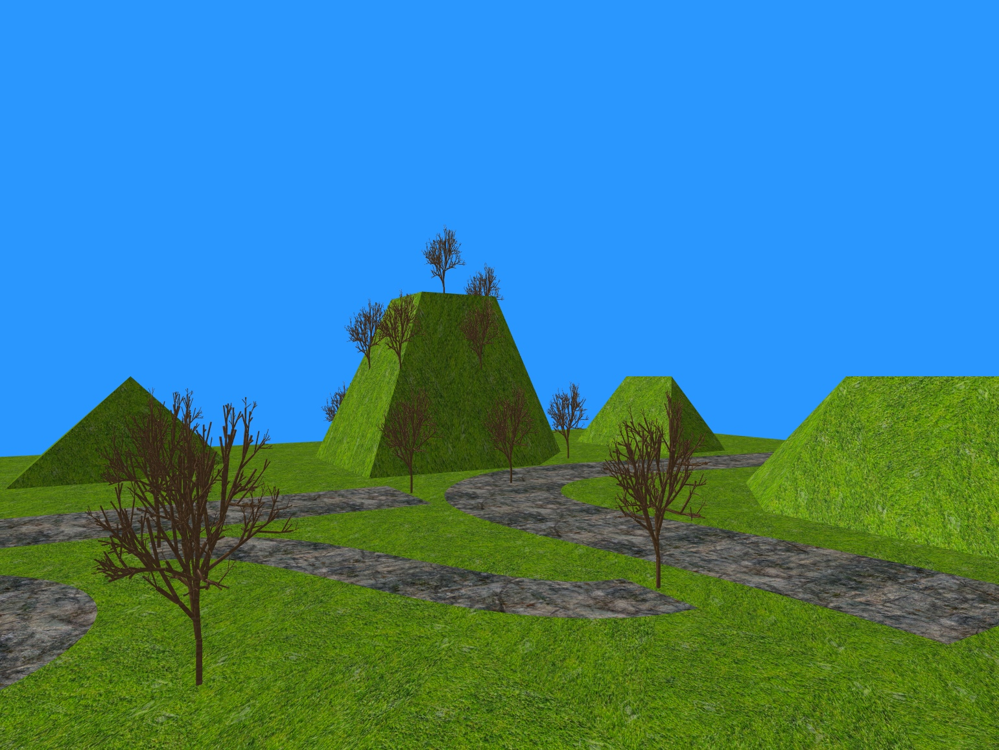

# 3D-World

## Introduction

This is a simple 3D game engine.

## Control 🎮

* ⬆️ : move forward
* ⬇️ : move backward
* ➡️ : turn right
* ⬅️ : turn left
* **V Key** : Switch between the first person view and the third person view
* **N Key** : Turn on/off the night mode
* **T Key** : Turn on/off the torch
* **S Key** : Turn on/off the sun mode

## Features 📝

* Terrain - mesh generation ✅
* Terrain - interpolating altitudes ✅
* Trees ✅
* Camera ✅
* Sunlight ✅
* Avatar / 3rd person ✅
* Road ✅
* Torchlight ✅
* Extensions
  * Add distance attenuation to the torch light ✅
  * Make the sun move and change colour according to the time of day ✅
  * Add ponds with animated textures to your world ✅
  * Fix road extrusion so roads can go up and down hills ✅ (Not Perfect)